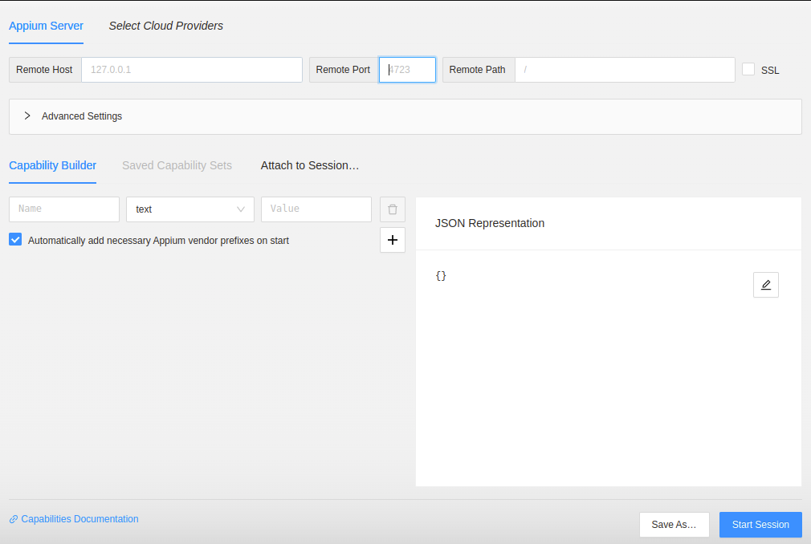
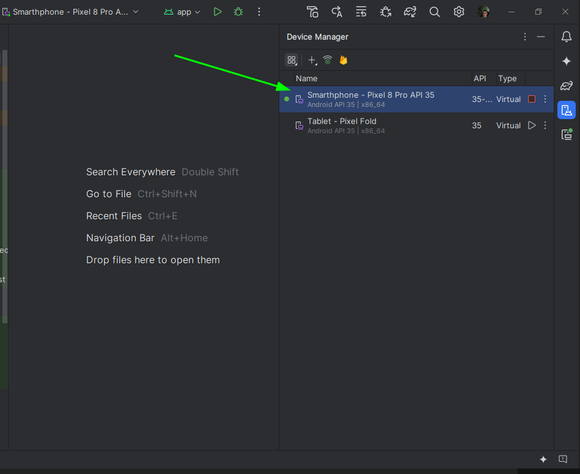

<h1 align="center">Mobile application automation with WebDriverIO and Appium</h1>
<br />

<p align="left">
  
  
  
  
</p>


<br>
<br>

This is a Test QA - project using [`webDriverIO`](https://webdriver.io/)
and Appium [`Appium`](https://appium.io/docs/en/latest/)

## Getting Started

You need to download the packages:

```bash
# Node
v20.18.0 lts
```

```bash
# npm version: 11.0.0
npm install -g pnpm
```
```bash
# Download dependencies
pnpm install
```

Run tests:

```bash
# Local Android device
pnpm test:android:local

# BrowserStack Android device
pnpm test:android:browserstack

# Local IOS device
pnpm test:ios:local

# BrowserStack IOS device
pnpm test:ios:browserstack
```

## About capture elements
### You need to use the command in the terminal to keep Appium running.
`appium --base-path /wd/hub`

<br>

You need to download the [`appium-inspector`](https://github.com/appium/appium-inspector/releases/tag/v2024.12.1).

## This is the app



### Enter Credentials
`Remote Host: 127.0.0.1`
`Remote Port: 4723` 
`Remote Path: /wd/hub`

### Android
```json
{
  "platformName": "Android",
  "appium:platformVersion": "15.0",
  "appium:deviceName": "Smarthphone - Pixel 8 Pro API 35",
  "appium:app": "./apps/android.wdio.native.app.v1.0.8.apk",
  "appium:appPackage": "com.wdiodemoapp",
  "appium:appActivity": ".MainActivity",
  "appium:automationName": "UiAutomator2"
} 
```

### "appium:platformVersion" is the operating system version of the Android emulator or physical device

### The "appium:deviceName" is the same name as the emulator in your android studio or physical device. Example in emulator: 


### Examples of how appium inspector fields are filled in


### Then just start the section

<br>

## Tips
### To discover the name appPackage
`adb install path_from_the_root_of_your_repository/test_qa_app/apps/android.wdio.native.app.v1.0.8.apk`

### Check which package 
`adb shell pm list packages | grep wdio`
